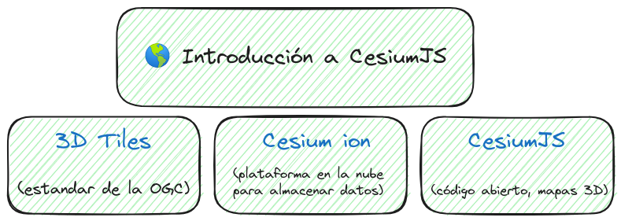

# 1. Introducción a CesiumJS  


## 1.1. ⭐ Introducción a CesiumJS

CesiumJS es una biblioteca JavaScript de código abierto que se utiliza para crear aplicaciones web de mapas 3D interactivos y visualizaciones geoespaciales.

 **3D Tiles:** Cesium creó la especificación 3D Tiles, ahora un estandar de la OGC.

**Cesium ion:** es una plataforma en la nube para almacenar datos. Podemos añadir nubes de puntos, edificios 3D, …

**Características de CesiumJS:**

1. Teselas 3D. 
2. Modelos 3D.
3. Capas de terreno e imágenes.
4. Capas vectoriales y geometría.
5. Visualización dinámica de tiempo.
6. Vistas 3D, 2.5D y 2D.

**Ejemplos de uso en CesiumJS**: https://sandcastle.cesium.com/

## 1.2. 👷 Entorno de Desarrollo

### 1.2.1. 🎯 Formas de usar CesiumJS:  

[📘 Doc](https://cesium.com/learn/cesiumjs-learn/cesiumjs-quickstart/)

1. **Instalación a través de npm (Node Package Manager):**
    
    ```bash
    npm install cesium
    ```
    
2. **Uso de CDN (Content Delivery Network):**

⚠️ Se recomienda poner en el head para evitar errores.  
  
ℹ️ Para desarrollar en chrome se necesita levantar un servidor. Para VSC - [Live Server](https://marketplace.visualstudio.com/items?itemName=ritwickdey.LiveServer).  
[⁉️ Error Foro](https://community.cesium.com/t/cesium-js-error-from-chrome/14550)  
[⁉️ Error Origin Null](https://stackoverflow.com/questions/8456538/origin-null-is-not-allowed-by-access-control-allow-origin)  

ℹ️ En Firefox funciona en el protocolo file://

    ```html
     <script src="https://cesium.com/downloads/cesiumjs/releases/1.117/Build/Cesium/Cesium.js"></script>
     <link href="https://cesium.com/downloads/cesiumjs/releases/1.117/Build/Cesium/Widgets/widgets.css" rel="stylesheet">
    ```
[Ejemplo HTML](https://github.com/AlvaroCodes/cesiumJS_notebook/blob/main/01_Introducci%C3%B3n_a_CesiumJS/examples/01-cdn-example.html)

### 1.2.2. 🔩 Entornos de Desarrollo:
⚠️ Se recomienda utilizar el CDN en vez de npm, problema con workers.

| Webpack      | Vite        |
|--------------|-------------|
| [📘 Doc](https://cesium.com/learn/cesiumjs-learn/cesiumjs-webpack/) <br/> [🗃️ Repositorio](https://github.com/CesiumGS/cesium-webpack-example/tree/main) | [🗃️ Repositorio](https://github.com/dayjournal/cesium-starter)  |


