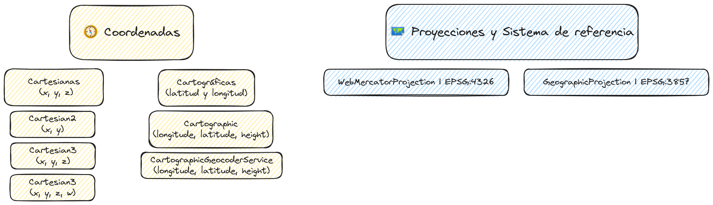

# Coordenadas, sistemas de referencia y proyecciones.


## 🧭 Coordenadas
Par de valores numéricos que representan la ubicación de un punto en la superficie de la Tierra. Estos valores, comúnmente expresados en grados decimales de latitud y longitud (cartográficas). En el caso de **CesiumJS** podemos entrar:
  * **Cartesianas**  
    Las coordenadas cartesianas se utilizan para representar puntos en un espacio bidimensional o tridimensional.
    Se representan como (x, y) para coordenadas 2D o (x, y, z) para coordenadas 3D.
  

    * **Cartesian2**: Un punto en coordenadas cartesianas en 2D (x,y).  
      [📘 Doc](https://cesium.com/learn/cesiumjs/ref-doc/Cartesian2.html)

     * **Cartesian3**: Un punto en coordenadas cartesianas en 3D (x, y, z).  
      [📘 Doc](https://cesium.com/learn/cesiumjs/ref-doc/Cartesian3.html)
    
      * **Cartesian4**: Un punto en coordenadas cartesianas en 4D (x, y, z, w).      
      La **"W"** representa el tiempo, un momento específico en el tiempo.  
      [📘 Doc](https://cesium.com/learn/cesiumjs/ref-doc/Cartesian4.html)
  * **Cartográficas**   
   Normalmente se expresan en latitud y longitud, que son medidas angulares con respecto al ecuador y el meridiano de Greenwich, respectivamente.

    * **Cartographic**: Las coordenadas son definidas por la longitud, latitud y la altura (longitude, latitude, height).  
      [📘 Doc](https://cesium.com/learn/cesiumjs/ref-doc/Cartographic.html)  
      
    * **CartographicGeocoderService**: Geocodifica consultas que contienen coordenadas cartográficas (longitude, latitude, height).  
      [📘 Doc](https://cesium.com/learn/cesiumjs/ref-doc/CartographicGeocoderService.html)  
      
        <br/>
   ```JavaScript
   import { Cartesian2, Cartesian3, Cartesian4, Cartographic } from 'cesium';
   const cat2 = new Certesian2(x, y)
   ```
## 🗺️ Proyecciones y Sistema de referencia
  * **WebMercatorProjection | EPSG:4326**. Esta proyección es el estándar para representar coordenadas geográficas (latitud y longitud), es una proyección cilíndrica, tiene la capacidad para representar áreas extensas de la Tierra con distorsión mínima.   
    EPSG:4326 representa las coordenadas geográficas en grados decimales de latitud y longitud, donde la latitud varía entre -90 y 90 grados y la longitud entre -180 y 180 grados.  
    [📘 Doc](https://cesium.com/learn/ion-sdk/ref-doc/WebMercatorProjection.html)
    
  * **GeographicProjection | EPSG:3857**.  Convierte las coordenadas geográficas en pares de coordenadas planas X e Y en metros, capacidad para representar grandes áreas con precisión pero puede introducir distorsiones en áreas cercanas a los polos.  
    [📘 Doc](https://cesium.com/learn/ion-sdk/ref-doc/GeographicProjection.html)

    
    <br/>
   ```JavaScript
   import { Viewer, WebMercatorProjection } from 'cesium';
   const viewer = new Viewer("cesiumContainer", mapProjection: new WebMercatorProjection());
   ```
