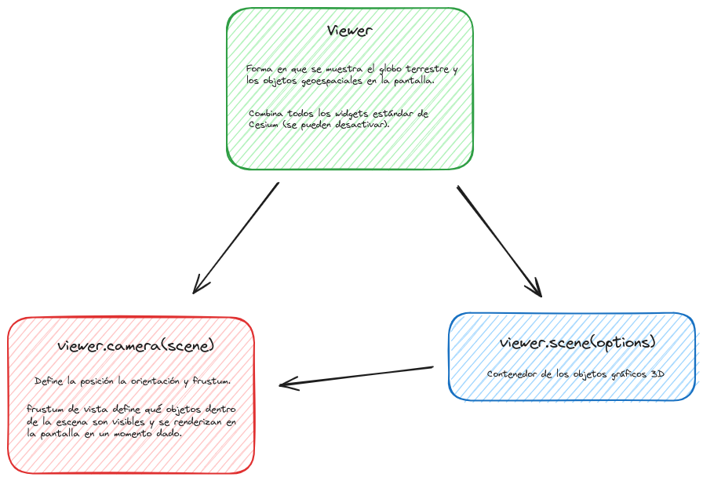

# Mapa
En cesium, un mapa es una visualización en 3D de datos geoespaciales proyectados sobre un globo terráqueo.  
El mapa en cesium se compone de 3 elementos, la vista, la cámara y la escena.

## Vista, cámara y escena



### 🌐 Vista (View): 

[📘 Documentación View CESIUM](https://cesium.com/learn/cesiumjs/ref-doc/Viewer.html?classFilter=view)

Se refiere a la forma en que se muestra el globo terrestre y los objetos geoespaciales en la pantalla. Puede haber diferentes tipos de vistas, como la vista en perspectiva (3D) o la vista en ortografía (2D). La vista se configura a través del objeto Viewer o CesiumWidget, que proporciona métodos para cambiar entre diferentes vistas, como la vista 3D, 2D o en primer plano.  

Creación de la vista y algunas de sus propiedades:

```javascript
new Viewer(
  idContenedor, // El ID del contenedor HTML donde se va a renderizar el globo o mapa de Cesium.
  {
    animation: false, // Deshabilita la barra de animación del tiempo (control de simulación del tiempo).
    fullscreenButton: false, // Deshabilita el botón para ver la vista en pantalla completa.
    vrButton: false, // Deshabilita el botón para activar la visualización en Realidad Virtual (VR).
    homeButton: false, // Deshabilita el botón de "Home", que devuelve la vista a la posición inicial.
    selectionIndicator: false, // Deshabilita el indicador visual que aparece cuando seleccionas un objeto en el mapa.
    skyBox: false, // Deshabilita la caja de cielo (skybox) que se muestra en el fondo del globo para representar el espacio.
    baseLayerPicker: false, // Deshabilita el selector de capas base, que permite cambiar entre diferentes fuentes de mapas (satélite, calles, etc.).
    geocoder: false, // Deshabilita el geocodificador que permite buscar lugares por nombre o coordenadas.
    infoBox: false, // Deshabilita el cuadro de información que aparece cuando seleccionas un objeto.
    sceneModePicker: false, // Deshabilita el selector de modo de escena (permite cambiar entre vista 2D, 3D y Columbus View).
    timeline: false, // Deshabilita la línea de tiempo que permite avanzar o retroceder en el tiempo cuando se visualizan datos con marcas temporales.
    navigationHelpButton: false, // Deshabilita el botón de ayuda de navegación que muestra instrucciones sobre cómo moverse en el mapa.
    navigationInstructionsInitiallyVisible: false, // Indica si las instrucciones de navegación deben estar visibles al principio (también desactivado).
    scene3DOnly: false, // Permite usar solo la vista 3D, si es true deshabilita otros modos como 2D y Columbus View.
    shouldAnimate: false, // Desactiva la animación automática en la escena, ideal para aplicaciones estáticas o que no requieran movimiento continuo.
    baseLayer: false, // Desactiva la capa base predeterminada (por defecto, se carga una capa de imágenes satelitales).
    mapProjection, // Proyección del mapa, define cómo se proyectan las coordenadas (puede ser EPSG:4326, EPSG:3857, etc.).
  }
)

```

<details>
  <summary>🟦 Bounding Box (bbox)</summary>

Un BBOX define los límites geoespaciales de un área.

```javascript
// setBbox
cesiumMap.camera.setView({
  destination: new Rectangle.fromDegrees(extent[0], extent[1], extent[2], extent[3]),
});
```

</details>

#### 🔍 Escala (Scale)
La escala permite a los usuarios interpretar correctamente las distancias y tamaños de los objetos mostrados en el mapa.

Para calcular la distancia entre dos puntos en la superficie del globo, se utiliza **_EllipsoidGeodesic_**. Este objeto permite calcular la distancia geodésica (la distancia más corta sobre la superficie del elipsoide) entre dos puntos.

```javascript
/*
Para calcular distancias sobre la superficie del globo (Ellipsoid.WGS84)
      
📘 Doc: https://cesium.com/learn/ion-sdk/ref-doc/EllipsoidGeodesic.html
*/
const geodesic = new Cesium.EllipsoidGeodesic();

/*
Coordenadas del borde inferior de la pantalla para obtener las posiciones de 
la izquierda y la derecha en el globo 
         
📘 Doc getPickRay: https://cesium.com/learn/cesiumjs/ref-doc/Camera.html#getPickRay
📘 Doc pick: https://cesium.com/learn/cesiumjs/ref-doc/Globe.html?classFilter=GLOBE#pick
*/

const left = scene.camera.getPickRay(new Cesium.Cartesian2((width / 2) | 0, height - 1));
const right = scene.camera.getPickRay(new Cesium.Cartesian2((1 + width / 2) | 0, height - 1));
const leftPosition = globe.pick(left, scene);
const rightPosition = globe.pick(right, scene);

/*
Las posiciones en coordenadas cartesianas se convierten a coordenadas cartográficas 
y se utilizan para calcular la distancia geodésica en la superficie del elipsoide.
*/
const leftCartographic = globe.ellipsoid.cartesianToCartographic(leftPosition);
const rightCartographic = globe.ellipsoid.cartesianToCartographic(rightPosition);

geodesic.setEndPoints(leftCartographic, rightCartographic);
const pixelDistance = geodesic.surfaceDistance; // Distancia en metros
```  
▶️ scaleLine: [📋 HTML](https://github.com/AlvaroCodes/cesiumJS_notebook/blob/main/03_Vista_camara_y_escena/examples/09_scaleLine.html)  | 🚀[CodePen](https://codepen.io/AlvaroCodes/pen/PovNOyX)

## 3.2. 📷 Cámara (Camera): 
Define la posición, orientación y campo de visión del observador virtual dentro del mundo 3D. Puedes controlar la cámara para cambiar la perspectiva del usuario sobre el globo terrestre o cualquier otro objeto en la escena. Puedes ajustar la posición y orientación de la cámara programáticamente para enfocarte en áreas específicas del globo o para seguir objetos en movimiento.  

[📘 Doc](https://cesium.com/learn/cesiumjs/ref-doc/Camera.html)   

<details>
  <summary>Valores por defecto</summary>

  * **Cesium.Camera.DEFAULT_OFFSET**  
  [📘 Doc](https://cesium.com/learn/cesiumjs/ref-doc/Camera.html#.DEFAULT_OFFSET)  

  *  **Cesium.Camera.DEFAULT_VIEW_FACTOR**  
  [📘 Doc](https://cesium.com/learn/cesiumjs/ref-doc/Camera.html#.DEFAULT_OFFSET)  

  *  **Cesium.Camera.DEFAULT_VIEW_RECTANGLE:** Te informa de la vista predeterminada de la cámara, propiedad solo de lectura.  
  [📘 Doc](https://cesium.com/learn/cesiumjs/ref-doc/Camera.html#.DEFAULT_OFFSET) || [📂 Ejemplo](https://github.com/AlvaroCodes/cesiumJS_notebook/blob/main/03_Vista_camara_y_escena/examples/02_dafault_view_rectangle.html)
</details>    

<details>
  <summary>Opciones de zooms</summary>  
  
* **Cantidad de zoom - "getZoom"** [📘 Doc](https://cesium.com/learn/ion-sdk/ref-doc/Cartographic.html#Cartographic)  
```javascript
  function getZoom() {
    // Obtener el nivel de zoom (lo muestra en metros)
    //  Te informa de la vista predeterminada de la cámara, propiedad solo de lectura.
    console.log(viewer.camera.positionCartographic.height);
  }
```  
  
* **zoomIn(amount)** [📘 Doc](https://cesium.com/learn/ion-sdk/ref-doc/Camera.html?classFilter=came#zoomIn)
```javascript
function setZoomIn(zoom) {
  // Cambiar nivel de zoom: Si no se pasa ningún valor por defecto viewer.camera.defaultZoomAmount (100000.0) 
  viewer.camera.zoomIn(zoom);
}
```

*  **zoomOut(amount)** [📘 Doc](https://cesium.com/learn/ion-sdk/ref-doc/Camera.html?classFilter=came#zoomOut)
```javascript
function setZoomOut(zoom) {
  // Cambiar nivel de zoom: Si no se pasa ningún valor por defecto viewer.camera.defaultZoomAmount (100000.0) 
  viewer.camera.zoomOut(zoom);
}
```

**📂 Ejemplos:**  
* Control del Zoom: [📋 HTML](https://github.com/AlvaroCodes/cesiumJS_notebook/blob/main/03_Vista_camara_y_escena/examples/01_Zoom.html) | 🚀[CodePen](https://codepen.io/mangelescarrillo/pen/LYvwdeN)

</details>   

---

**Ejemplos Cesium:**    
▶️ [Manejo de la cámara con el teclado](https://sandcastle.cesium.com/?src=Camera%20Tutorial.html&label=All)  
▶️ [Opciones vuelos cámara](https://sandcastle.cesium.com/?src=Camera.html&label=All)
