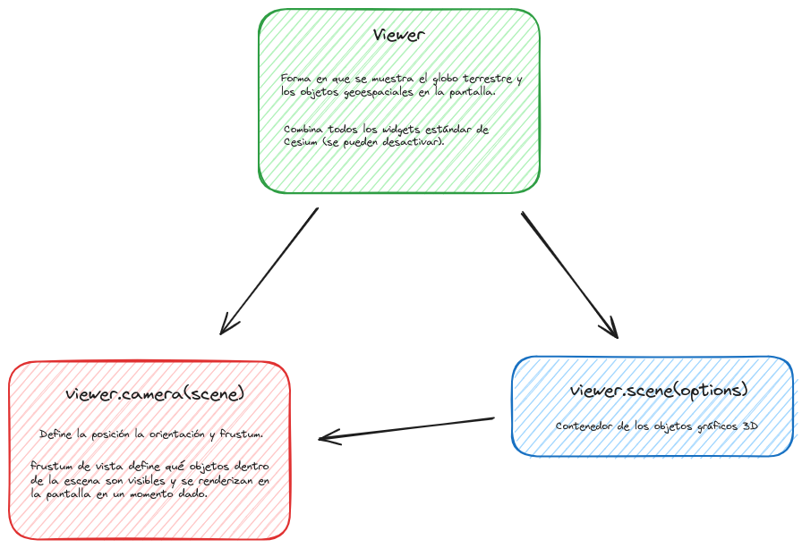

# Vista, cámara y escena. los marcadores

## 🌐 Vista (View): 
Se refiere a la forma en que se muestra el globo terrestre y los objetos geoespaciales en la pantalla. Puede haber diferentes tipos de vistas, como la vista en perspectiva (3D) o la vista en ortografía (2D). La vista se configura a través del objeto Viewer o CesiumWidget, que proporciona métodos para cambiar entre diferentes vistas, como la vista 3D, 2D o en primer plano.  

[📘 Doc](https://cesium.com/learn/cesiumjs/ref-doc/Viewer.html?classFilter=view)

##  📷 Cámara (Camera): 
Define la posición, orientación y campo de visión del observador virtual dentro del mundo 3D. Puedes controlar la cámara para cambiar la perspectiva del usuario sobre el globo terrestre o cualquier otro objeto en la escena. Puedes ajustar la posición y orientación de la cámara programáticamente para enfocarte en áreas específicas del globo o para seguir objetos en movimiento.  

[📘 Doc](https://cesium.com/learn/cesiumjs/ref-doc/Camera.html)   

**Ejemplos:**  
▶️ [Control del Zoom](https://github.com/AlvaroCodes/cesiumJS_notebook/blob/main/03_Vista_camara_y_escena/01_Zoom.html)  

**Ejemplos Cesium:**    
▶️ [Manejo de la cámara con el teclado](https://sandcastle.cesium.com/?src=Camera%20Tutorial.html&label=All)  
▶️ [Opciones vuelos cámara](https://sandcastle.cesium.com/?src=Camera.html&label=All)

## ⛰️ Escena (Scene):
Es el lienzo en el que se renderizan todos los elementos gráficos, como el globo terrestre, los modelos 3D, ...  

📘 Doc: https://cesium.com/learn/cesiumjs/ref-doc/Scene.html?classFilter=scene
