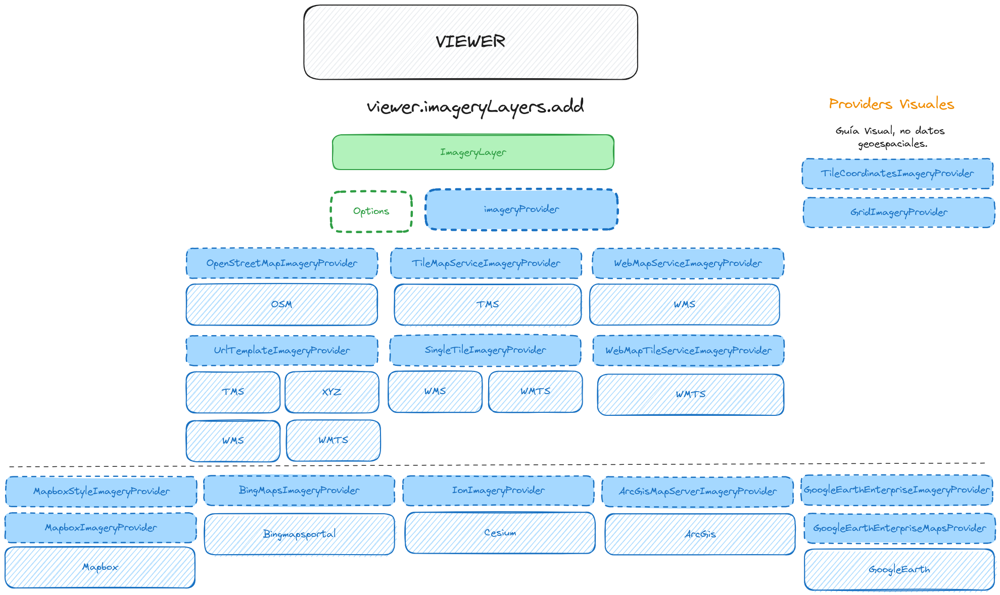

# Capas Raster  



## OpenStreetMapImageryProvider  | OSM  
Proporciona imágenes en mosaico alojadas en OpenStreetMap, por defecto "https://tile.openstreetmap.org/".
```javascript
const viewer = new Cesium.Viewer("map");

const osmProvider = new Cesium.OpenStreetMapImageryProvider({
  url : 'https://tile.openstreetmap.org/'
});

viewer.imageryLayers.addImageryProvider(osmProvider);
```

[📘 Doc](https://cesium.com/learn/ion-sdk/ref-doc/OpenStreetMapImageryProvider.html)

**Ejemplos:**  
▶️ [openstreetmap](https://github.com/AlvaroCodes/cesiumJS_notebook/blob/main/05_Capas_raster/examples/03_OpenStreetMapImageryProvider.html)  

## TileMapServiceImageryProvider | TMS - XYZ
[📘 Doc](https://cesium.com/learn/ion-sdk/ref-doc/TileMapServiceImageryProvider.html)

## WebMapServiceImageryProvider | WMS
[📘 Doc](https://cesium.com/learn/ion-sdk/ref-doc/WebMapServiceImageryProvider.html)

## UrlTemplateImageryProvider | TMS - XYZ - WMS - WMTS
[📘 Doc](https://cesium.com/learn/ion-sdk/ref-doc/UrlTemplateImageryProvider.html)  

**Ejemplos:**  
▶️ [openstreetmap](https://github.com/AlvaroCodes/cesiumJS_notebook/blob/main/05_Capas_raster/examples/01_UrlTemplateImageryProvider.html)  
▶️ [mierune + credit](https://github.com/AlvaroCodes/cesiumJS_notebook/blob/main/05_Capas_raster/examples/02_UrlTemplateImageryProvider.html)

## SingleTileImageryProvider | WMS - WMTS
[📘 Doc](https://cesium.com/learn/ion-sdk/ref-doc/SingleTileImageryProvider.html)
▶️ [Dog Img](https://github.com/AlvaroCodes/cesiumJS_notebook/blob/main/05_Capas_raster/examples/04_SingleTileImageryProvider.html)  

## WebMapTileServiceImageryProvider | WMTS
[📘 Doc](https://cesium.com/learn/ion-sdk/ref-doc/WebMapTileServiceImageryProvider.html)

## Providers Visuales
* TileCoordinatesImageryProvider  
  [📘 Doc](https://cesium.com/learn/ion-sdk/ref-doc/TileCoordinatesImageryProvider.html)
* GridImageryProvider  
  [📘 Doc](https://cesium.com/learn/ion-sdk/ref-doc/GridImageryProvider.html)

## Otros Providers
* **Mapbox**
  * **MapboxStyleImageryProvider**  
    [📘 Doc](https://cesium.com/learn/ion-sdk/ref-doc/MapboxStyleImageryProvider.html)
  * **MapboxImageryProvider**  
    [📘 Doc](https://cesium.com/learn/ion-sdk/ref-doc/MapboxImageryProvider.html?classFilter=mapbox)
* **Bingmapsportal**
   * BingMapsImageryProvider  
    [📘 Doc](https://cesium.com/learn/ion-sdk/ref-doc/BingMapsImageryProvider.html?classFilter=Bingmaps)
* **Cesium**
   * IonImageryProvider  
    [📘 Doc](https://cesium.com/learn/ion-sdk/ref-doc/IonImageryProvider.html?classFilter=ionima)
* **ArcGis**
  * ArcGisMapServerImageryProvider  
    [📘 Doc](https://cesium.com/learn/ion-sdk/ref-doc/ArcGisMapServerImageryProvider.html?classFilter=arc)
* **GoogleEarth**
  * GoogleEarthEnterpriseImageryProvider  
    [📘 Doc](https://cesium.com/learn/ion-sdk/ref-doc/GoogleEarthEnterpriseImageryProvider.html)
  * GoogleEarthEnterpriseMapsProvider  
    [📘 Doc](https://cesium.com/learn/ion-sdk/ref-doc/GoogleEarthEnterpriseMapsProvider.html)
