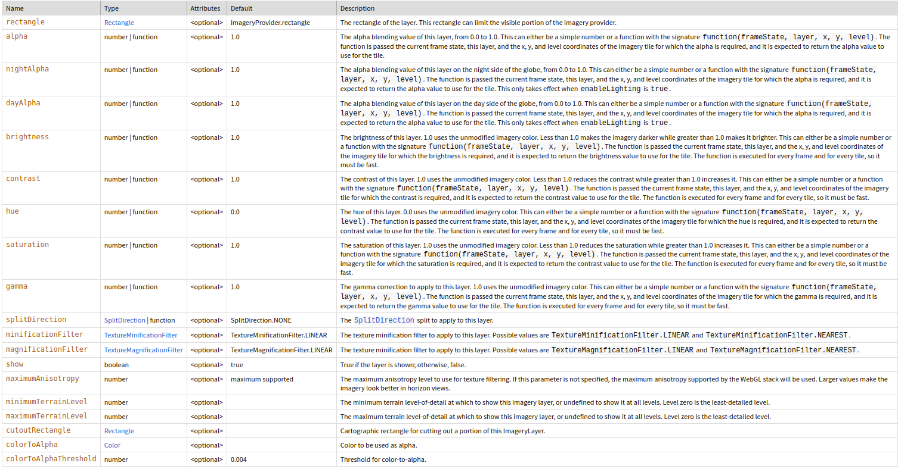

# XYZ

<details>
  <summary>ℹ️ ¿Qué es una XYZ?</summary>

Una XYZ es un tipo de servicio de mapas en la web que proporciona mosaicos (tiles) como imágenes raster organizadas en un esquema de cuadrículas. Cada mosaico tiene una dirección (X, Y) que indica su posición en el nivel de zoom (Z) específico.
    
</details>

## ImageryLayer  

[📘 Documentación ImageryLayer CESIUM](https://cesium.com/learn/cesiumjs/ref-doc/ImageryLayer.html?classFilter=ImageryLaye)  

Capa Rástes que recibe un provedor ```(new Cesium.ImageryLayer(imageryProvider, options))```.  

Para añadir y eliminar una capa:  

```javascript
// Añadir
viewer.imageryLayers.add(xyz);
// Eliminar
viewer.imageryLayers.remove(xyz);
```

**Parámetros de la capa:**  



<details>
  <summary>minimumTerrainLevel y maximumTerrainLevel</summary>

    - minimumTerrainLevel: El nivel mínimo de detalle del terreno en el que se mostrará esta capa de imágenes, o indefinido para mostrarla en todos los niveles. 
    - maximumTerrainLevel: El nivel máximo de detalle del terreno en el que se mostrará esta capa de imágenes, o indefinido para mostrarla en todos los niveles.

</details>

<details>
  <summary>rectangle</summary>

🧭 "MaxExtent en Openlayers"

Restringe la visualización a una región específica. 

[📘 Documentación rectangle CESIUM](https://cesium.com/learn/cesiumjs/ref-doc/UrlTemplateImageryProvider.html?classFilter=UrlTemplateImageryProvider#rectangle)

```javascript
const xyz = new Cesium.ImageryLayer(
    UrlTemplateImageryProvider,
    {
      rectangle : Cesium.Rectangle.fromDegrees(96.799393, -43.598214999057824, 153.63925700000001, -9.2159219997013),
    }
);

viewer.imageryLayers.add(xyz);
```

</details>

<details>
  <summary>Alpha</summary>

Valor Alpha, se puede utilizar para dar opacidad a la capa. Valor por defecto 1.0.  
  
🧭 "Opacity en Openlayers"

 [📘 Documentación alpha CESIUM](https://cesium.com/learn/cesiumjs/ref-doc/ImageryLayer.html?classFilter=ImageryLayer#alpha)
  
```javascript
const xyz = new Cesium.ImageryLayer(
    UrlTemplateImageryProvider,
    {
      alpha: 0.5,
    }
);

viewer.imageryLayers.add(xyz);
```  

</details>  

<details>
  <summary>Show</summary>
Determina si se muestra o no la capa.

🧭 "Visibility en Openlayers"
  
 [📘 Documentación show CESIUM](https://cesium.com/learn/cesiumjs/ref-doc/ImageryLayer.html?classFilter=ImageryLayer#show)
  
```javascript
const xyz = new Cesium.ImageryLayer(
    UrlTemplateImageryProvider,
    {
      show: false,
    }
);

viewer.imageryLayers.add(xyz);
```  
</details> 


## UrlTemplateImageryProvider

[📘 Documentación UrlTemplateImageryProvider CESIUM](https://cesium.com/learn/cesiumjs/ref-doc/UrlTemplateImageryProvider.html?classFilter=UrlTemplateImageryProvider)

Se utiliza para cargar imágenes de teselas desde un servidor con la especificicación XYZ.

```javascript
const xyzProvider = new Cesium.UrlTemplateImageryProvider({
    url: 'https://www.ign.es/web/catalogo-cartoteca/resources/webmaps/data/cresques/{z}/{x}/{y}.jpg',
});
```

**UrlTemplateImageryProvider contiene los siguientes parámetros:**

<details>
  <summary>URL</summary>

ℹ️ Para los valores negativos "{-z}", "{-x}" y "{-y}" se tiene que sustituir por "{reverseZ}", "{reverseX}" y "{reverseY}".
```javascript
const reverseRepleceUrl = (url) => {
return url
        .replace('{-z}', '{reverseZ}')
        .replace('{-x}', '{reverseX}')
        .replace('{-y}', '{reverseY}')
}
```

</details>

<details>
  <summary>tileWidth y tileHeight</summary>

🧭 "TileSize en Openlayers"

Tamaño de la tesela, por defecto los valores son 256.

[📘 Documentación tileWidth](https://cesium.com/learn/cesiumjs/ref-doc/UrlTemplateImageryProvider.html?classFilter=UrlTemplateImageryProvider#tileWidth)  

[📘 Documentación tileHeight](https://cesium.com/learn/cesiumjs/ref-doc/UrlTemplateImageryProvider.html?classFilter=UrlTemplateImageryProvider#tileHeight)


```javascript
const osmProvider = new Cesium.UrlTemplateImageryProvider({
   url: 'https://www.ign.es/web/catalogo-cartoteca/resources/webmaps/data/cresques/{z}/{x}/{y}.jpg',
   tileWidth: 256,
   tileHeight: 256
});

viewer.imageryLayers.addImageryProvider(osmProvider);
```

</details>

<details> 
  <summary>maximumLevel y minimumLevel</summary>

🧭 "TileGridMaxZoom y TileGridMinZoom en Openlayers"

 Zoom máximo y mínimo de la tesela en forma de rejilla. 

[📘 Documentación maximumLevel](https://cesium.com/learn/cesiumjs/ref-doc/UrlTemplateImageryProvider.html?classFilter=UrlTemplateImageryProvider#maximumLevel)  

[📘 Documentación minimumLevel](https://cesium.com/learn/cesiumjs/ref-doc/UrlTemplateImageryProvider.html?classFilter=UrlTemplateImageryProvider#minimumLevel)  

```javascript
const osmProvider = new Cesium.UrlTemplateImageryProvider({
   url: 'https://www.ign.es/web/catalogo-cartoteca/resources/webmaps/data/cresques/{z}/{x}/{y}.jpg',
   maximumLevel:  17, // especifica el nivel máximo creado en el servicio para permitir hacer "overzoom"
});

viewer.imageryLayers.addImageryProvider(osmProvider);
```

</details>

## Proxy (Resource)

<details>
  <summary>ℹ️ Uso del Proxy en las XYZ</summary>

Debido a que la [política del mismo origen](https://en.wikipedia.org/wiki/Same-origin_policy) no restringe las solicitudes de imágenes, en general, un XYZ no tendrá problemas con la política del mismo origen para cargar mosaicos desde dominios diferentes (no se hacen solicitudes complejas que devuelvan XML, GML u otros tipos de datos estructurados).

En XYZ, estás solicitando principalmente mosaicos que son imágenes raster (archivos PNG, JPEG, etc.), lo cual no suele estar restringido por la política del mismo origen. 

Cuando puede ser necesario un proxy en XYZ: 

- Control de acceso: Si los mosaicos contienen información sensible o si el servicio XYZ está restringido para ciertos usuarios.
- Distribución de carga: Si se está sirviendo un gran volumen de mosaicos y se quiere evitar que los usuarios accedan directamente al servidor XYZ, se puede usar un proxy para distribuir las solicitudes o cachéar los mosaicos para mejorar el rendimiento. 

</details>

**Resource**

[📘 Documentación Resource CESIUM](https://cesium.com/learn/cesiumjs/ref-doc/Resource.html)

Esta clase permite configurar parámetros como URL, encabezados, y proxies, así como manejar solicitudes con opciones avanzadas.

También incluye métodos para obtener diferentes tipos de datos, como JSON, blobs e imágenes, y puede manejar solicitudes de cross-origin (CORS) si están habilitadas.

```javascript
const urlService = 'URL DEL SERVICIO';

const url = new Resource({
    url: urlService,
    proxy: new DefaultProxy('/proxyPost?url='),
});

const tile = new UrlTemplateImageryProvider({ url });
```

## Manejo de Capas XYZ

- Funcionamiento de las capas Base en cesium:
  - Si no existe otra capa base, se pondrá la primera que se cargue.
  - CESIUM solo permite tener una capa como base.
  - En caso de eliminar una capa base automáticamente se pondrá como base la siguiente no base.
- ¿Cómo obtener la extensión de la capa?
  - ```cesiumLayer.getImageryRectangle();```
- ¿Cómo modificar la extensión de la capa?
  - ```cesiumLayer._rectangle = rectangle;```
- zIndex en las capas:
  - El índice de las capas se gestiona por medio de [ImageryLayerCollection](https://cesium.com/learn/cesiumjs/ref-doc/ImageryLayerCollection.html) y se puede añadir cuando se hace el add.
  Por ejemplo: ```imageryLayers.add(cesiumLayer, zIndex)```
- getMinZoom y getMaxZoom
  - getMinZoom: cesiumLayer._minimumTerrainLevel
  - getMaxZoom: cesiumLayer._maximumTerrainLevel